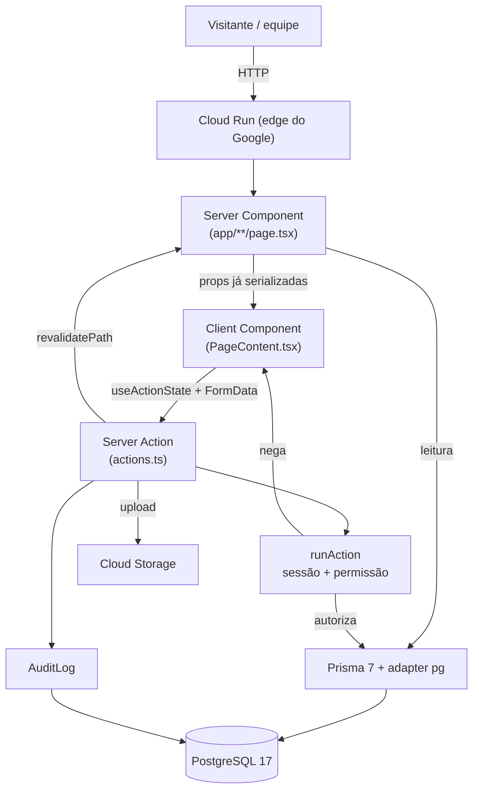
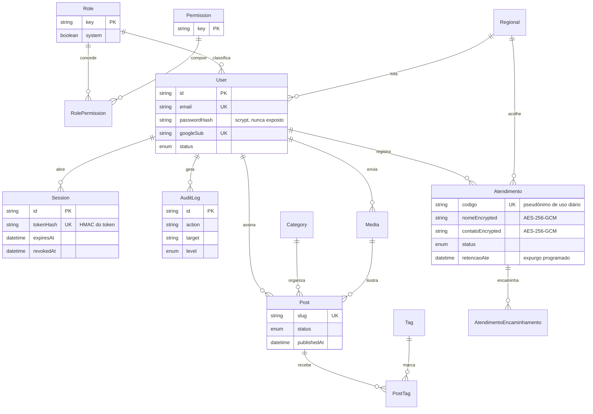
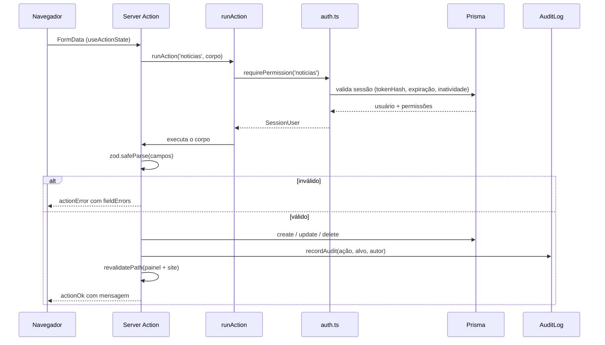
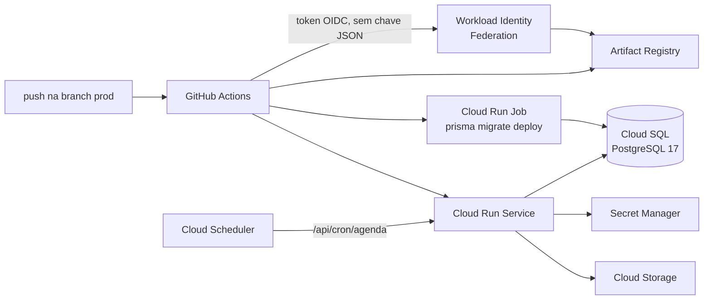

# Arquitetura

Este documento registra **as decisões e o porquê delas**. O que o código faz
está no código; o que não dá para ler no código é a razão de ter sido feito
assim, e é isso que se perde quando a equipe muda.

Contexto que condiciona tudo o que vem a seguir: uma organização pequena, sem
equipe de tecnologia dedicada, que precisa manter um site institucional e um
painel interno que registra **atendimento a pessoas migrantes** — ou seja, dado
pessoal sensível. As duas restrições de projeto são **custo baixo** e
**responsabilidade sobre dado pessoal**.

---

## Visão geral



O ponto que importa nesse desenho: **não existe caminho do navegador para o
banco que não passe pelo `runAction`**. Não há API REST paralela, não há rota
que aceite JSON arbitrário. Sessão e permissão são verificadas num lugar só.

---

## Decisões

### 1. Next.js com App Router

O site é majoritariamente conteúdo institucional, e conteúdo institucional
precisa aparecer no Google e carregar rápido em conexão ruim. Renderizar no
servidor resolve os dois.

O App Router entra porque **Server Components resolvem o problema certo aqui**:
a página que lista notícias consulta o banco no servidor, monta o HTML e manda
só o resultado. O navegador não baixa o cliente do Prisma, não faz uma segunda
requisição para buscar dados e não fica com um estado de carregamento na tela.

Onde há interatividade real (filtro, formulário, upload), o padrão é fixo:

| Arquivo           | Papel                                                          |
| ----------------- | -------------------------------------------------------------- |
| `page.tsx`        | Server Component: busca dados, exporta `metadata`, passa props |
| `PageContent.tsx` | `'use client'`: estado, formulário, interação                  |
| `actions.ts`      | `'use server'`: mutação, validação, auditoria                  |

O Client Component **nunca** importa nada de `lib/server/`. Esses módulos
começam com `import 'server-only'`, então uma importação errada quebra o build
em vez de vazar segredo para o bundle. É proteção estrutural, não disciplina.

### 2. Prisma 7 com driver adapter

O Prisma 7 usa **query compiler em WebAssembly** com driver adapter
(`@prisma/adapter-pg` sobre `pg`), em vez do binário nativo de engine das
versões anteriores.

Por que isso importa aqui:

- **A imagem Docker continua Alpine e enxuta.** Não há engine nativa para
  casar com a libc do sistema — a origem clássica de "funciona na minha máquina,
  quebra no contêiner".
- **Sem processo lateral.** A engine antiga subia um processo próprio; o
  compilador WASM roda dentro do Node. Em Cloud Run, onde se paga por
  vCPU-segundo e o cold start é visível, um processo a menos conta.
- **A conexão é do `pg`.** Quem controla o pool é uma biblioteca madura e
  conhecida, o que facilita ajustar comportamento sob o socket do Cloud SQL.

O client é gerado em `lib/generated/prisma` (fora do `node_modules`, para
entrar no bundle standalone) e **não é versionado** — `prisma generate` roda no
`postinstall` e no build da imagem.

### 3. Sessão no banco, não JWT

A escolha mais consequente do sistema.

JWT é cômodo: não exige consulta, escala sem estado. Mas um JWT emitido **é
válido até expirar**, e é aí que ele não serve para este caso:

| Situação real                   | Sessão no banco               | JWT                                      |
| ------------------------------- | ----------------------------- | ---------------------------------------- |
| Desativar quem saiu da equipe   | Acesso cai no próximo request | Continua valendo até expirar             |
| Notebook roubado                | `revokeAllSessions(userId)`   | Nada a fazer                             |
| "Quem estava logado no dia 12?" | Consulta na tabela `Session`  | Não se sabe                              |
| Expirar por inatividade         | `lastSeenAt` a cada request   | Só com refresh token e mais complexidade |

Num painel com ficha de atendimento a migrante, **poder revogar acesso agora**
e **poder responder quem acessou** não são requisitos técnicos: são requisitos
de conformidade (`docs/PRIVACIDADE.md`). Uma consulta indexada por request é um
preço baixo por isso.

Como está feito (`lib/server/auth.ts`):

- Cookie `spm_session`, `httpOnly`, `sameSite=lax`, `secure` em produção.
- No banco fica só o **HMAC** do token, não o token. Vazamento de dump de banco
  não vira sessão ativa.
- Expiração absoluta de 12h e inatividade de 30 minutos.
- Bloqueio após 5 tentativas erradas, por 15 minutos, com registro em
  `LoginAttempt`.

### 4. `scrypt` do Node, sem dependência de hashing

`bcrypt` e `argon2` são ótimos e trazem compilação nativa junto. O Node já
tem `scrypt` — um KDF com custo de memória, recomendado para senha — na
biblioteca padrão.

Trocar uma dependência nativa por uma função do runtime, num projeto que uma
pessoa vai manter sozinha daqui a dois anos, é um ganho real: menos
`node-gyp`, menos surpresa em atualização de Node, menos superfície de cadeia
de suprimentos.

Formato guardado: `scrypt$<salt base64>$<hash base64>`. O prefixo existe para
que uma migração futura de algoritmo consiga distinguir os formatos.

### 5. Server Actions em vez de API REST

Não há `app/api/**` para o painel. As mutações são Server Actions, e rota de
API só existe onde **quem chama não é um formulário deste site**: o webhook do
cron (`/api/cron/agenda`, chamado pelo Cloud Scheduler), o callback do OAuth
(chamado pelo Google) e a entrega de arquivo quando o armazenamento é local.

O motivo é redução de superfície. Uma API REST exigiria, para cada operação:
rota, validação de corpo, verificação de sessão, verificação de permissão,
CORS, e um cliente no front para chamá-la. Com Server Action, o formulário
aponta direto para a função e `runAction` centraliza sessão, permissão,
tratamento de erro e formato de resposta:

```ts
export async function salvarNoticia(_prev: ActionState, formData: FormData) {
    return runAction('noticias', async (user) => {
        // aqui dentro, `user` já está autenticado e já tem a permissão
    });
}
```

Menos lugares onde esquecer a verificação. O custo é acoplamento ao Next.js —
aceito conscientemente, porque não há aplicativo móvel nem integração externa
prevista.

### 6. Páginas `force-dynamic`

Toda página que consulta o Postgres declara:

```ts
export const dynamic = 'force-dynamic';
```

Sem isso, o Next tenta pré-renderizar em tempo de build — e o `docker build`
roda **sem banco**, no GitHub Actions. O build quebraria, ou pior: congelaria
conteúdo desatualizado numa página estática.

É também coerente com o produto: notícia publicada, edital aberto e agenda
mudam durante o dia. Cache aqui seria bug, não otimização.

A contrapartida é que cada visita bate no banco. Para o volume desta
organização, isso não é problema — e o Cloud Run reaproveita a mesma instância
e o mesmo pool de conexões entre requisições.

### 7. Cifragem de coluna no módulo de atendimentos

O banco inteiro já é cifrado em repouso pelo Cloud SQL. Ainda assim, `nome` e
`contato` da ficha de atendimento são cifrados **pela aplicação**, com
AES-256-GCM (`lib/server/crypto.ts`), antes de chegarem ao banco.

A diferença é quem consegue ler:

| Camada                | Protege contra                              | Não protege contra           |
| --------------------- | ------------------------------------------- | ---------------------------- |
| Cifragem do Cloud SQL | Roubo de disco físico                       | Quem tem acesso ao banco     |
| Cifragem de coluna    | Dump, backup, consulta direta, log de query | Comprometimento da aplicação |

Quem obtiver um backup do banco vê códigos pseudônimos (`ATD-2026-0142`),
faixa etária e necessidades — não vê nome nem telefone. A chave está no Secret
Manager, separada do banco, com acesso concedido a **uma** conta de serviço.

Três consequências assumidas:

1. **Não dá para buscar por nome no SQL.** É intencional: a equipe trabalha
   pelo código do atendimento.
2. **Perder a `ENCRYPTION_KEY` é perder os dados.** Por isso ela é gerada uma
   vez e guardada fora do sistema também.
3. `decryptSensitive` **nunca lança** — um registro corrompido vira `null` e a
   tela continua de pé, em vez de derrubar a lista inteira.

O princípio anterior à criptografia é a **minimização**: a ficha guarda o
mínimo para o encaminhamento. O schema diz explicitamente para não registrar
situação documental. Dado que não existe não vaza — ver `docs/PRIVACIDADE.md`.

### 8. Armazenamento com dois provedores

`lib/server/storage.ts` fala com disco local ou Cloud Storage, escolhido por
`STORAGE_DRIVER`. O acesso ao GCS é pela **API REST**, autenticando pelo
servidor de metadados do Cloud Run — sem SDK do Google.

Motivo: o SDK do Google Cloud é grande e traz cadeia de dependências
desproporcional a "enviar um arquivo". Duas chamadas `fetch` resolvem, e a
mesma abordagem serve para o Calendar (`lib/server/google-calendar.ts`).

Consequência prática: o sistema roda igual numa VPS com `docker compose` e no
Cloud Run. Isso preserva a saída — se o custo do GCP virar problema, migrar não
exige reescrever o módulo de arquivos.

### 9. Degradação explícita das integrações

Nenhuma integração é obrigatória para o sistema subir:

| Sem configurar  | O que acontece                                                |
| --------------- | ------------------------------------------------------------- |
| SMTP            | Mensagem do Fale Conosco é gravada; só não há e-mail de aviso |
| Google OAuth    | O botão de login com Google não aparece                       |
| Google Calendar | A agenda mostra só os eventos cadastrados no painel           |
| `GCS_BUCKET`    | Uploads vão para o disco local                                |

`lib/server/env.ts` **não lança na importação**. Quem exige configuração valida
no ponto de uso. Isso é o que permite ao `docker build` rodar sem segredo
nenhum e ao ambiente de desenvolvimento subir com um `.env` mínimo.

---

## Modelo de dados



Três coisas para notar:

1. **Permissão é dado, não código.** `Permission` e `RolePermission` são
   tabelas; a matriz de perfis é editável pelo painel sem deploy. As chaves
   (`noticias`, `midia`, `editais`, `atendimentos`, `usuarios`, `config`) são
   as mesmas strings que aparecem em `runAction(...)`.
2. **`Atendimento` não se liga a `ContactMessage` nem a nada do site público.**
   O módulo com dado sensível é uma ilha, ligada só a `Regional` e ao usuário
   que registrou.
3. **`retencaoAte` existe desde o primeiro dia.** Retenção não é um projeto
   futuro: é uma coluna com data, prevista para expurgo automático.

---

## Fluxo de uma mutação



Regras que valem para toda ação, sem exceção:

- **Validar com zod.** Nada vindo de `FormData` é confiável.
- **Auditar criação, alteração, exclusão e mudança de status.** `recordAudit`
  nunca lança: auditoria que falha não pode derrubar a operação que a gerou.
- **`revalidatePath` das rotas afetadas**, painel e site público. Uma notícia
  publicada precisa aparecer nos dois.
- **Nunca devolver `passwordHash`, `tokenHash`, `inviteTokenHash` ou campos
  `*Encrypted`.** Listagens usam `select` explícito.

---

## Implantação



A imagem é multiestágio, com um estágio `migrator` separado que carrega só
Prisma, schema e migrações. A migração roda como **job**, antes da nova
revisão entrar no ar — assim duas instâncias nunca migram ao mesmo tempo
durante um deploy.

Isso impõe uma regra de disciplina: **toda migração precisa ser compatível com
a versão anterior da aplicação**, porque durante alguns segundos o código
antigo ainda está atendendo com o esquema novo. Adicionar coluna, sim; remover
coluna, só num segundo deploy.

Detalhes de infraestrutura, custo e passo a passo: `infra/README.md`.

---

## O que ficou de fora, e por quê

| Não tem                  | Por quê                                                                                                 |
| ------------------------ | ------------------------------------------------------------------------------------------------------- |
| Redis / cache externo    | Não há problema de carga que justifique. Complexidade sem ganho                                         |
| Fila de jobs             | O único trabalho assíncrono é a agenda, e o Cloud Scheduler resolve                                     |
| GraphQL                  | Um consumidor só (o próprio site). Server Actions bastam                                                |
| CMS externo              | O painel é o CMS, e o conteúdo é indissociável do modelo de permissões                                  |
| MFA                      | **Falta reconhecida.** Recomendação da ANPD, prevista no schema (`mfaRequired`), ainda não implementada |
| Portal de titular (LGPD) | Hoje o pedido chega pelo Fale Conosco e é tratado manualmente                                           |

As duas últimas linhas são dívida consciente, não esquecimento — estão
registradas em `docs/PRIVACIDADE.md` com o resto do que falta.
